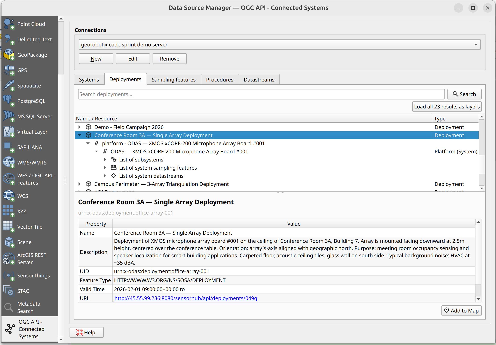

# QGIS OACS Plugin

A [QGIS] plugin for working with [OGC API - Connected Systems] servers

[QGIS]: https://qgis.org
[OGC API - Connected Systems]: https://ogcapi.ogc.org/connectedsystems/

---

**Documentation:** <https://byteroad.github.io/qgis-oacs-plugin>

**Source code:** <https://github.com/byteroad/qgis-oacs-plugin>

---

This is a QGIS plugin to work with OACS servers. It allows you to discover and visualize datasets exposed as OCS
resources.

## Installation

This plugin will eventually become available for installation via the main QGIS plugin repository, but for now
you can install it via our development instructions, as mentioned in the [development section](development.md). 

Once early versions are released, you will also be able to install from our custom plugin repository, as mentioned in 
the callout below.

??? info "Extra - Installing from our custom plugin repo"

    A custom plugin repo is available at:
    
    <https://byteroad.github.io/qgis-oacs-plugin/repo/plugins.xml>

    1. Add this custom repository inside QGIS Plugin Manager
    1. Allow experimental plugins
    1. Refresh the list of available plugins
    1. Search for a plugin named **OACS**
    1. Install it!

Proceed to the [User guide](user-guide.md) section for next steps.

## License

This plugin is distributed under the terms of the
[GNU General Public License version 3](https://www.gnu.org/licenses/gpl-3.0.en.html)
