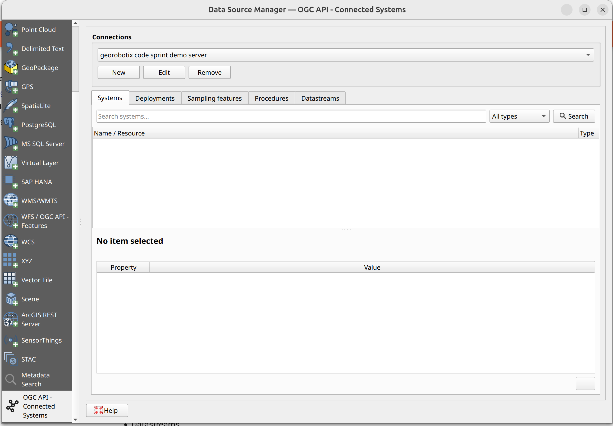
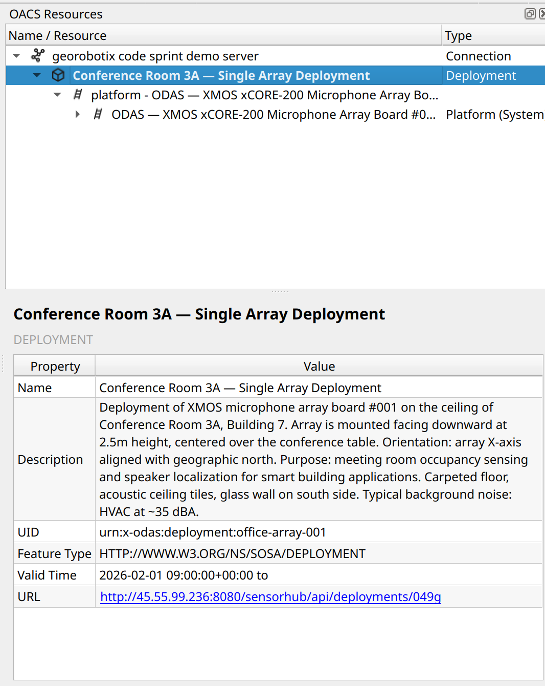
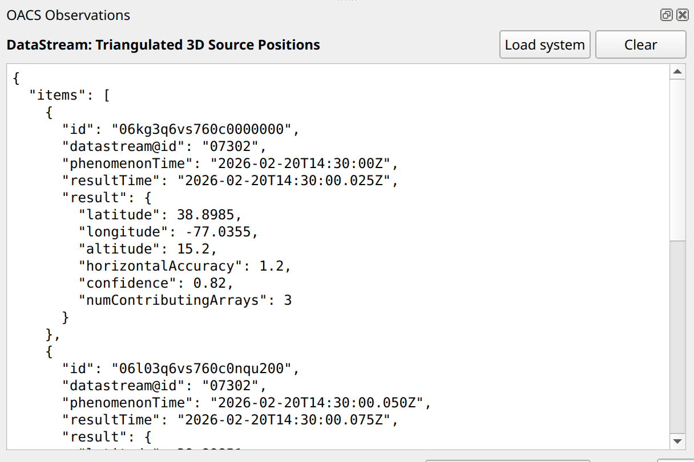

# User guide

The QGIS OACS plugin allows you to browse through the resources exposed by servers that implement the 
[OGC API - Connected Systems] (OACS) standard.


[OGC API - Connected Systems]: https://ogcapi.ogc.org/connectedsystems/


## Installation

This plugin will soon be available for installation via the main QGIS plugin repository, but for now
you can install it from our private repo, as mentioned in the callout below.


!!! info "Installing from our custom plugin repo"

    A custom plugin repo is available at:
    
    <https://byteroad.github.io/qgis-oacs-plugin/repo/plugins.xml>

    1. Add this custom repository inside QGIS Plugin Manager
    1. Allow experimental plugins
    1. Refresh the list of available plugins
    1. Search for a plugin named **OACS**
    1. Install it!


## Overview

QGIS OACS plugin has the following components:

- A QGIS data source selector - this allows configuring connections to OACS servers, 
  discovering resources and loading them onto QGIS
- A panel that shows currently loaded OACS resources and allows browsing their connected resources for further 
  inspection and loading
- A panel for visualizing observation results


## OACS Data source selector

The Data source selector is where you configure connections and load resources onto the QGIS map canvas.
Open it from the QGIS Data Source Manager, or via **Plugins → OGC API Connected Systems → Open data source selector**.




### Managing connections

Use the connection bar at the top to create, edit, or remove connections to OACS servers. Each connection
stores the server URL, an optional name, and authentication settings.


### Browsing resources

The selector has five tabs, one per resource type: 

- Systems, 
- Deployments, 
- Sampling Features,
- Procedures,
- Datastreams.

In each tab:

1. Type in the search bar and either press Enter or click the **Search** button
2. Results appear in the tree. Click any item to see its details in the panel below.
3. Expand an item to reveal its related resources.
4. To load a resource as a QGIS layer, select it and click **Add as layer** (or **Add to map** 
   if the resource has a spatial location), or use the **Load all results** button 
   (where available) to load the entire result set at once.


## OACS resources panel

The OACS Resources panel is a dockable panel that tracks every OACS resource you have loaded onto the
map canvas. It lets you explore related resources without reopening the data source selector.
It can be shown/hidden by pressing the QGIS OACS button shown in the QGIS toolbar.



The panel shows a tree, which is organized as:

```
Connection
└── Loaded resource (bold)
      └── Related resource group  (e.g. "Datastreams", "Deployments")
            └── Individual related resource
                  └── … (expands further on demand)
```

Expanding any node fetches the corresponding data from the server on the fly. Selecting an item shows
its metadata in the detail panel at the bottom of the dock.

To load a related resource onto the map, select it and use the **Add to map** button in the detail panel.


## OACS observations panel

The OACS Observations panel displays raw observation results for a datastream. It appears automatically
when observation data is retrieved.

The panel shows:

- The name of the datastream whose observations are being displayed.
- The observation payloads as plain text, pretty-printed if the content is JSON.



Two actions are available:

- **Load system** — loads the parent system of the current datastream as a QGIS layer.
- **Clear** — dismisses the current observations.
